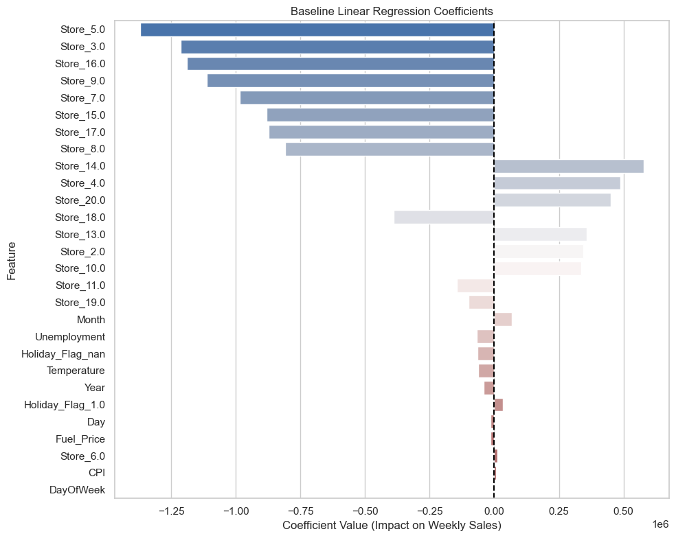
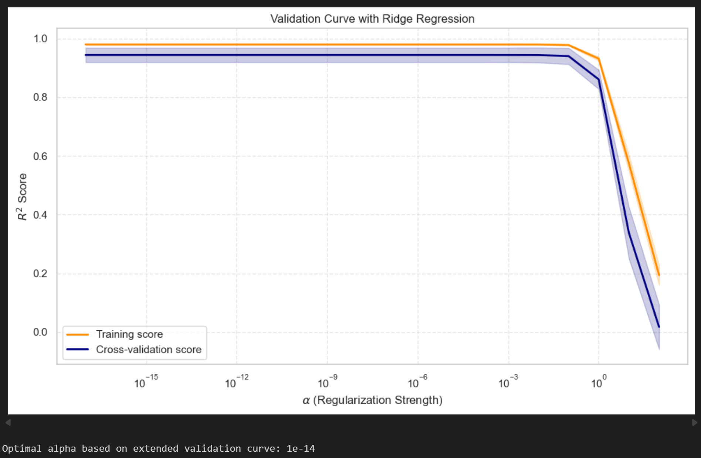
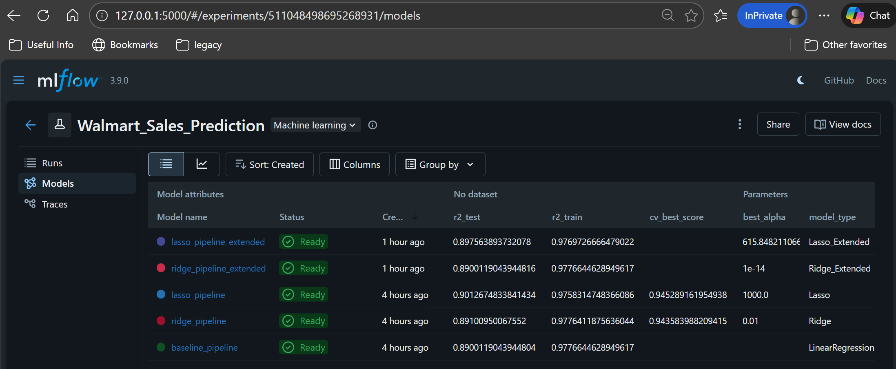

# Walmart Weekly Sales Prediction

## Project Overview
Walmart's marketing service requires a machine learning model to estimate weekly sales across various stores. The objective is to achieve the highest possible precision to understand how sales are influenced by economic indicators such as unemployment rate and fuel price, aiding future marketing campaigns. 

This project fulfills the validation requirements for Bloc 3: Machine Learning (Structured Data) of the RNCP35288 Certification.

## Objectives
1. Perform Exploratory Data Analysis (EDA) and preprocess the data.
2. Train and evaluate a baseline Linear Regression model.
3. Apply regularized regression models (Lasso and Ridge) to mitigate potential overfitting.

## Repository Structure
```
├── assets/              # Visualizations and exported graphics
├── data/
│   ├── raw/             # Original Walmart_Store_sales.csv
│   ├── processed/       # Cleaned and engineered dataset
├── docs/                # Project documentation and instructions
├── notebooks/
│   ├── 01-EDA_and_Data_Cleaning.ipynb       # Data exploration and cleaning pipeline
│   ├── 02-Modeling_and_Tracking.ipynb       # Model training, GridSearch, and MLflow logging
├── src/                 # Reusable Python scripts
├── README.md            # Project documentation
├── requirements.txt     # Python dependencies
└── .gitignore           # Ignored files and folders (e.g., mlruns)
```

## Hardware Optimization Note
This project utilizes the `scikit-learn-intelex` patch. Scripts and notebooks explicitly call `patch_sklearn()` to optimize underlying operations for Intel-based architectures.

## Execution Instructions
**1. Environment Setup:** Install the required dependencies using pip:
```bash
pip install -r requirements.txt
```

**2. Data Pipeline:**
Execute `notebooks/01-EDA_and_Data_Cleaning.ipynb` to clean the raw data, drop missing targets, handle outliers (3-sigma rule), and extract date features. This produces the cleaned dataset in the `data/processed/` folder.

**3. Model Training:**
Execute `notebooks/02-Modeling_and_Tracking.ipynb`. This pipeline builds a `scikit-learn` ColumnTransformer for scaling and encoding, trains the baseline model, and performs hyperparameter tuning (`GridSearchCV`) for Ridge and Lasso regression.

**4. Experiment Tracking:**
All models and metrics are logged via MLflow locally. To compare performances and visualize runs, launch the MLflow UI from the repository root:
```bash
mlflow ui
```
Access the dashboard at `http://localhost:5000`.

## Results Visualized

### Feature Importance (Baseline Model)

*Analysis of linear regression coefficients indicating the strongest drivers of weekly sales. This interprets the model's coefficients to identify what features are important for the prediction.*

### Overfitting Diagnostics (Ridge Validation Curve)

*Validation curve demonstrating the optimal regularization strength and the absence of severe overfitting in the baseline.*

### Experiment Tracking

*MLflow dashboard used to track parameters, model artifacts, and R2 scores across Baseline, Ridge, and Lasso experiments.*

## Key Findings
* **Baseline Performance:** The standard Linear Regression model established a strong baseline with an interpretable coefficient analysis.
* **Regularization Impact:** Validation curves generated during the hyperparameter search indicated minimal overfitting in the baseline model. Consequently, Ridge regression optimized at an alpha near zero (effectively mirroring the baseline), while heavier Lasso penalties induced underfitting.